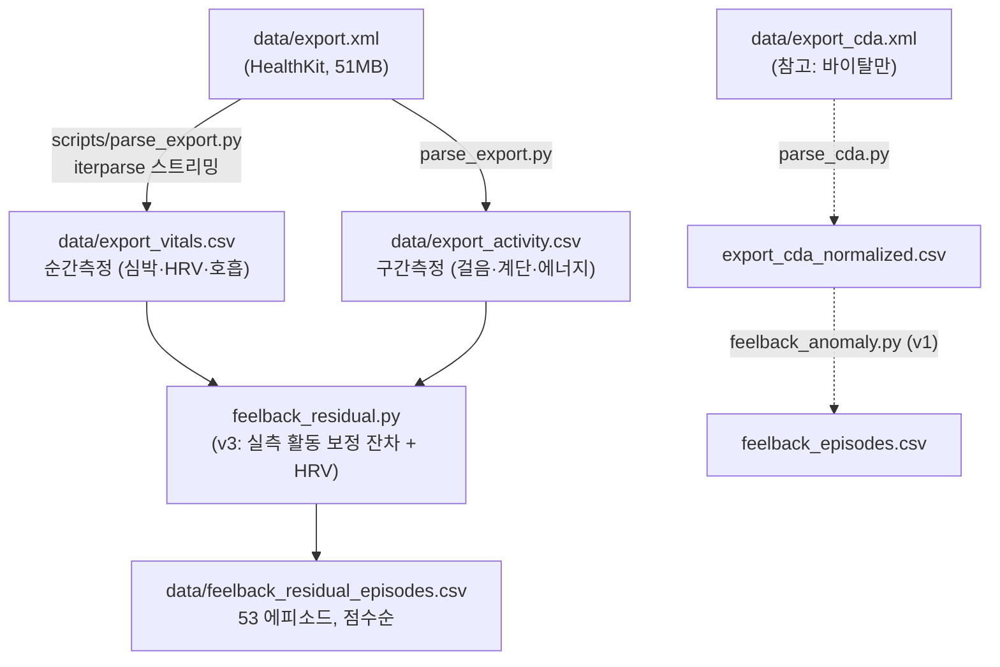

# Feelback: 데이터 파싱 & 탐지 모델 구조

Apple Watch 데이터에서 **감정적으로 의미 있는 심박 순간**을 찾아내는 파이프라인 설명서다.
"단순 달리기·계단 오르기가 아닌 감정 변화를, 신체 활동 데이터로 걸러서" 잡는 것이 목표다.
XML 파일 구조 자체는 [export_cda_structure.md](export_cda_structure.md)를 참고.

## 두 개의 내보내기 파일

Apple 건강 내보내기 zip에는 형식이 다른 두 XML이 들어있고, 담긴 데이터가 다르다.

| 파일 | 형식 | 담긴 것 | 파서 |
|---|---|---|---|
| `export_cda.xml` | HL7 CDA (중첩 observation) | 바이탈 3종(심박·SpO2·호흡수)만 | `scripts/parse_cda.py` |
| `export.xml` | HealthKit (평탄한 Record) | **걸음·계단·활동에너지·HRV·운동세션** 등 전부 | `scripts/parse_export.py` |

초기 분석은 CDA만 있어서 활동 데이터 없이 진행했으나, **`export.xml`이 확보되면서
실측 활동 기반 모델(v3)로 넘어갔다.** 아래 파이프라인의 주 경로는 `export.xml`이다.

## 파이프라인 개요



| 파일 | 역할 |
|---|---|
| `scripts/parse_export.py` | **export.xml → 바이탈/활동 두 CSV** (주 파서) |
| `scripts/parse_cda.py` | export_cda.xml → 바이탈 CSV (초기 파서, 참고용) |
| `feelback_residual.py` | **v3 탐지 모델** (실측 활동 보정 + HRV) |
| `feelback_anomaly.py` | v1 탐지 모델 (안정 상태 필터, 초기 버전) |

---

# 1단계: 데이터 파싱 (`scripts/parse_export.py`)

## 1-1. 왜 스트리밍(iterparse)인가

`export.xml`은 51MB, Record 12만 건이다. `ET.fromstring`으로 통째로 올리면 메모리를 크게
먹는다. `iterparse`로 `<Record>`를 하나씩 처리하고 즉시 `clear()`해 메모리를 일정하게 유지한다.
전체 파싱이 약 5초.

## 1-2. 순간 측정 vs 구간 측정 (핵심 구분)

Record는 두 종류이고, 이 구분이 뒤 단계의 시간 정렬을 좌우한다.

| 종류 | 판별 | 예시 | 저장 |
|---|---|---|---|
| **순간 측정** | `startDate == endDate` | 심박, 호흡수, SpO2, HRV | `export_vitals.csv` (long-format) |
| **구간 측정** | `startDate < endDate` | 걸음, 계단, 활동에너지, 활동강도 | `export_activity.csv` (start/end/value 유지) |

구간 측정은 그 구간 동안의 누적/평균이라, 순간 측정인 심박에 붙이려면 별도 정렬이 필요하다
(→ 2-3).

## 1-3. 파싱 결과

`export_vitals.csv` (순간 측정, 4,063행) / `export_activity.csv` (구간 측정, 43,682행)

| 바이탈 | 건수 | 기간 | | 활동 | 건수 | 기간 |
|---|---|---|---|---|---|---|
| Heart rate | 3,889 | 07-01~07-19 | | steps | 11,799 | **2025-06** ~ 07-19 |
| HRV SDNN | 69 | 07-01~07-19 | | active_energy | 12,612 | 2025-06 ~ 07-19 |
| Resting HR | 17 | 07-01~07-19 | | flights | 1,343 | 2025-06 ~ 07-18 |
| Respiratory | 16 | 07-04~07-17 | | physical_effort | 4,575 | 07-01~07-19 |

> 심박이 CDA(3,275)보다 export.xml(3,889)에 더 많고 최신(07-19)이라, **심박 소스를
> export.xml로 일원화**했다. export.xml의 심박도 `motion_context` 메타데이터를 그대로 보유한다.

---

# 2단계: 탐지 모델 (`feelback_residual.py`)

## 2-1. 핵심 질문

v1은 "가만히 있는데 심박이 높은가?"를 물었고, `motion_context==1` 샘플만 봐서 전체의 61%를
버렸다. v3는 실측 활동으로 질문을 바꾼다:

```
기대HR = 시간대 기준선 + f(걸음·계단)
잔차   = 실제HR − 기대HR
탐지   = 잔차가 큰 순간   ← motion_context 라벨과 무관, 실측 걸음이 움직임을 정량화
확인   = 그 순간 HRV가 개인 기준선 대비 눌렸는가
```

이게 원래 목표를 직접 해결한다. 걸음수가 움직임을 수치로 말해주므로 **"살짝 걷는 중의 감정
반응"(걸음 조금 + 심박 급등)도 잡는다.**

## 2-2. ⚠ 순환논리 함정 — 왜 활동에너지를 예측에 안 쓰는가

`active_energy`가 심박과 상관 +0.81로 가장 높다. 하지만 **예측 피처로 쓰면 안 된다.**
Apple의 ActiveEnergyBurned는 부분적으로 심박에서 역산되기 때문이다. 실측 검증:

| 조건 (걸음 정확히 0 = 움직임 전무) | 심박 중앙값 |
|---|---|
| 에너지 > 5 kcal | **157** |
| 에너지 ≤ 5 kcal | **83** |

움직임이 전혀 없는데 에너지가 심박을 그대로 따라간다 = 에너지는 심박의 그림자다.
이걸 예측에 넣으면 **"심박 157은 33kcal 활동으로 설명됨"이라며 정작 찾으려는 감정성
급등을 스스로 지워버린다.** `physical_effort`도 같은 오염(정지 시 상관 +0.61)이 있다.

**결론: 예측 피처는 가속도계 기반 순수 움직임 신호(`steps`, `flights`)만.** 이들은 심박과
독립이라 오염이 없다. 에너지·활동강도는 결과를 사람이 읽을 때 참고용으로만 붙인다.

## 2-3. 활동 피처 정렬 (구간 → 순간)

걸음 등 구간 측정을 심박 샘플에 붙이는 방법 (`build_activity_timeline`):

1. 분 단위 타임라인에 각 구간의 값을 **덮는 분들에 균등 배분**한다.
2. 누적합(prefix sum)을 만들어, 임의의 창 `[t−5분, t]` 합을 **차분으로 O(1)** 계산.
3. 걸음 소스는 **iPhone만** 쓴다. iPhone과 Watch를 섞으면 구간이 겹쳐 이중계상되지만
   (같은 소스 내 겹침은 0%), iPhone 단독은 전 기간을 깔끔히 덮는다.

## 2-4. 걸음이 못 잡는 것 — 밀도 기반 운동 세션 탐지

걸음·계단은 걷기·계단 강도는 잡지만 **걸음이 안 찍히는 정지성 운동(실내 자전거·근력·심박
버스트)을 놓친다.** 실제로 이것 때문에 심박 194(걸음 0)·179(램프업)가 오탐으로 샜다.

해법은 v2에서 쓰던 **샘플링 밀도**다. 워치는 운동 중에만 초 단위로 기록하므로 고밀도 연속
구간 = 운동 세션이다 (`detect_sessions`). 걸음 피처와 밀도 세션은 **상호 보완**이라 둘 다 쓴다:

```
1. 간격 ≤ 30초로 이어지는 샘플을 "런"으로 묶는다
2. 런 크기 ≥ 5 AND 런 내부 간격 중앙값 ≤ 15초  →  고밀도 런
3. 고밀도 런 사이 ≤ 5분  →  이어붙여 하나의 세션으로 (워치가 운동 심박을 끊긴 버스트로 기록)
```

세션 내부(70개, 2,262샘플)는 후보에서 제외한다. 세션 밖만 걸음·계단으로 기대HR을 보정해 판정.

## 2-5. 기대HR 모델 — Huber 회귀 + 그룹별 잔차 척도

```
기대HR = 시간대 기준선(hour, 안정 샘플 중앙값, 인접 ±1시간 원형 평활)
         + β·[steps_5m, flights_5m]
```

- **Huber IRLS 회귀** (`huber_fit`, numpy 30줄): 감정 에피소드는 소수 이상치다.
  최소제곱이면 그 이상치가 계수를 끌고 가 **모델이 감정을 "정상"으로 학습**해버린다.
- **잔차 z는 정지/활동 그룹별로** 척도를 잡는다. 활동 시 잔차는 넓게, 정지 시 좁게
  흩어지므로(강도 추정 오차), 하나의 MAD로 재면 활동 잔차가 산포를 부풀려
  **정지 상태의 조용한 감정 반응을 묻어버린다.**

실제 계수: `steps_5m +0.070` (걸음 100보당 심박 +7), `flights_5m +1.285` (계단 1층당 +1.3).

## 2-6. HRV 교차확인 & 점수

각 후보 근처(±20분) HRV가 개인 중앙값의 75% 이하로 눌렸으면 **감정의 직접 생리 증거**다.

```
점수 = 잔차 z
     + 급발현(+15bpm↑)      · +1.0
     + 야간(23~07시)         · +1.0
     + 호흡수 동반상승(≥18)  · +0.5
     + HRV 눌림              · +1.5   ← 최고 가점
```

탐지 게이트는 2경로: `z ≥ 2.5` **OR** (급발현 AND `z ≥ 1.5`). 감정 각성은 크기보다 속도가
특징이라, 절대값이 크지 않아도 급발현이면 잡는다. 10분 이내 연속 탐지는 한 에피소드로 병합.

---

# 결과 & 검증

## 실측 데이터가 해결한 것

| 사례 | v2(활동 추정) 판정 | v3(실측) 판정 |
|---|---|---|
| 07-02 20:41 심박 171 | "운동인지 감정인지 불명" (Tier B 유보) | 직전 걸음 다수 + 계단 → **운동 확정, 배제** |
| 07-15 20:45 심박 194 | (밀도 세션으로 배제) | 걸음 0이지만 밀도 세션 → **정지성 운동 배제** |
| 07-01 19:56 심박 111 | 근거 부족 | 걸음 0 + **HRV 9.8 붕괴** → 감정 후보 상위 |

## 대표 탐지 예 (감정 시그니처별)

```
07-12 13:27  심박119(기대82) 걸음0    급발현+45   → 고립 스파이크 (점수 1위)
07-16 23:52  심박105(기대79) 걸음0    야간·급발현  → 야간 각성
07-01 19:56  심박111(기대87) 걸음0    HRV 9.8     → HRV 붕괴 동반 스트레스
```

---

# 일지 대조 검증

사용자가 사진·일정으로 복원한 감정 사건 일지(정확한 기록은 아니고 근사)와 탐지 결과를
대조했다. 라벨이 "전체 감정 사건"이 아니라 "기억나는 일부"라서 **정밀도(precision)는 계산
불가**하고(탐지 53건 중 일지에 없는 것이 오탐인지 미기록 감정인지 구분 안 됨), **재현율
(recall) 관점**에서 "알려진 사건을 잡았는가"만 평가한다.

| 사건 (일지) | 원본 심박 | 탐지 | 판정 |
|---|---|---|---|
| **7/03 커피챗 긴장** | 101~126 지속(중앙 118), 거의 정지 | 14:56 초과+37, z=4.6 | ✅ 명확히 일치 |
| **7/12 공포 영상** | 최대 133, **급발현 3회**(+37/+32/+37) | 10:48·11:00·11:41 | ✅ 가장 강한 일치 |
| **7/15 방탈출 공포** | 81~96(약함), 샘플 9개뿐 | 14:38 초과+14, 급발현+15 | 🔸 약한 일치(데이터 희소) |
| **7/04 스트레스** | 최대 136이나 걸음 1,424(이동 많음) | 13:12 점수 2.8 | 🔸 이동과 뒤섞임 |
| **7/05 컨디션 저조** | 심박 평범(중앙 83) | 미미 | ⚠️ 다른 시그니처 (아래) |
| **7/16 스트레스(19시)** | 56~94(오히려 낮음) | 없음 | ❌ 미탐/시간 불일치 |
| 7/11 맥주 | — | — | ⬜ 데이터 없음(워치 미착용) |
| 7/14 술 | 20건뿐 | — | ⬜ 워치 꺼짐(메모와 일치) |

대조 가능한 6건 중 유의미하게 잡음 **4건**(명확 2 + 약함 2), 다른 시그니처 1, 미탐 1.

## 검증이 밝힌 3가지

1. **급발현 경로가 공포 반응에서 정확히 작동한다.** 7/12 공포 영상에서 심박 급등→하강이
   3회 연속 잡혔다. 점프 스케어에 대한 놀람 반응과 일치. 급발현 게이트 설계가 검증됐다.

2. **급성 각성과 만성 저조는 생리 시그니처가 반대다.** 7/05 "컨디션 저조"는 심박 스파이크가
   아니라 **HRV 바닥 사건**이었다 — 그날 HRV 14~18ms(개인 평균 32의 절반), 심박은 평범.
   현재 모델은 심박 스파이크(급성 각성)만 보므로 이런 만성 저조는 구조적으로 놓친다.
   결함이 아니라 **확장 지점**이다 (아래 한계 4).

3. **이동과 뒤섞인 감정은 여전히 어렵다.** 7/04는 심박 136까지 올랐으나 걸음 1,424보라
   스트레스와 걷기가 분리 안 돼 약한 점수로만 남았다.

## 남은 한계

1. **걸음 선형 모델은 빠른 걷기 심박을 과소예측**한다(걸음 300~400보 구간이 중간 순위로
   남음). 걸음만으로 걷기 강도를 완전히 설명할 수 없어서다. 다만 점수 랭킹이 이들을 하위로
   밀고 정지 상태 스파이크를 상위로 올리므로 실사용엔 무리 없다.
2. **HRV 69건은 시간대별 기준선을 잡기엔 적다.** 전역 중앙값을 써서, 운동 직후 HRV 하락과
   감정성 하락을 완벽히 분리하진 못한다.
3. **정밀도(precision)는 아직 미측정.** 일지가 전체 감정을 담지 못해, 일지에 없는 탐지가
   오탐인지 미기록 감정인지 판단할 수 없다. 완전한 일지가 있어야 오탐율을 잴 수 있다.
4. **만성 저조/피로는 못 잡는다.** 급성 심박 스파이크만 본다. 7/05처럼 "며칠에 걸친 HRV
   저하 + 안정시심박 변화"로 나타나는 컨디션 저조를 잡으려면 별도 모듈이 필요하다.
