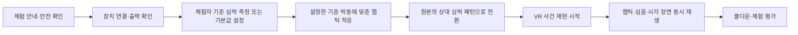
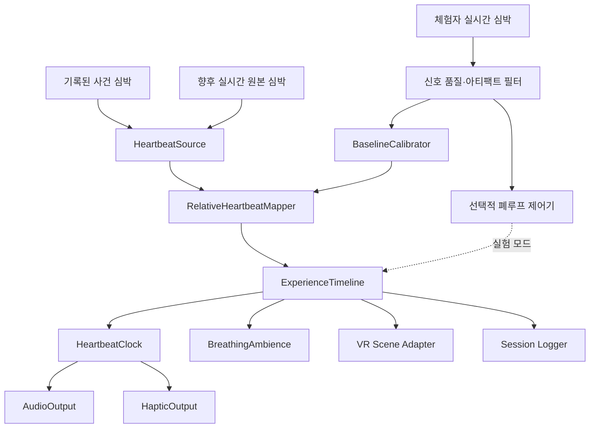

# 상대 심박 기반 햅틱·VR 체험 제안서

## 1. 최종 제안

본 프로젝트의 목표는 체험자의 실제 심장을 다른 사람의 심장과 박동 단위로 강제 동기화하는 것이 아니다. 다음과 같이 정의한다.

> 기록된 사람의 평균 대비 심박 변화와 각성·이완 흐름을 체험자의 개인 심박 범위로 변환하고, VR에 들어가기 전 햅틱과 소리로 먼저 체화한 뒤 동일한 흐름을 VR 사건 재현으로 연결한다.

이 목표는 현재 연구 근거와 구현 가능성에 부합한다. 음악과 공연은 여러 사람의 심박 상승·하강 경향을 비슷하게 만들 수 있지만, 외부 박자와 실제 심장이 한 박씩 정확히 맞는다는 근거는 약하다. 따라서 제품의 핵심 가치는 `심장 제어`가 아니라 `타인의 생리적 경험을 내 몸의 언어로 번역하는 것`에 둔다.

실제 심박의 변화 또는 원본 패턴 추종 여부는 부가적인 탐색 지표로 측정한다. 향후 실시간 심박 센서를 연결해 폐루프 피드백을 실험할 수 있도록 시스템은 처음부터 확장 가능한 구조로 설계한다.

### 현재 구현 상태

2026-08-06 기준으로 1차 VR 코드에 다음 항목을 반영했다.

- VR 진입 전 `장치 확인 → 기준 박동 적응 → 상대 패턴 전환 → VR 준비` 흐름
- 수동 기준 심박 설정과 기록 심박의 개인 상대 범위 변환
- 8초 기준 박동 적응, 10초 상대 패턴 전환, 40초 핵심 순간 재현, 8초 쿨다운
- 심음 박동 이벤트를 화면 펄스와 모바일 진동·일반 게임패드에 전달하는 프로토타입
- 후보 기능으로 구현했으나 기본 비활성화한 EDA 기반 합성 호흡 분위기
- 진동 장치가 없을 때 심음만으로 계속 진행하는 폴백
- 기록 배열을 공통 입력 계약으로 감싼 `HeartbeatSource` 확장 지점
- 사건별 프리루드 시간·강도를 설정할 수 있는 `experience.heartbeat` 매니페스트

현재 수동으로 선택하는 값은 실제 측정 심박이 아니므로 UI에서는 `내 심박`이 아니라 `체감 기준 BPM`으로 구분한다. 또한 타임스탬프가 없는 센서 배열은 40초 재현 구간에 균등 배치되므로 원속도 재생이 아니라 상승·정점·완화 흐름을 표현하는 극적 보간이다. 호흡 데이터도 없으므로 합성 호흡 후보는 기본적으로 끄고, 기능 플래그를 켜는 실험에서만 `재구성 호흡 분위기`로 표시한다.

아직 구현하지 않은 범위는 WebXR 컨트롤러 및 전용 흉부 햅틱 장치 어댑터, 정밀한 공통 박동 스케줄러와 장치 지연 보정, 실시간 심박 센서 연결, 신호 품질 필터, 반응형 안전 개인화 및 폐루프 동기화 제어다.

---

## 2. 과학적 근거와 해석 범위

현재 근거로 주장할 수 있는 범위는 다음과 같다.

- 같은 공연을 경험한 관객들의 심박 상승·하강 패턴은 서로 비슷해질 수 있다.
- 음악의 강약, 구조적 전환, 시청각적 몰입은 심박과 각성 반응에 영향을 줄 수 있다.
- 햅틱 심박 피드백은 외부 박동을 신체 내부 신호처럼 지각하도록 돕는다.
- 느린 심박형 진동은 실제 심박을 직접 바꾸지 않더라도 주관적 불안이나 각성 경험에 영향을 줄 수 있다.
- 호흡을 함께 유도하면 심박변이도와 느린 심박 변화를 유도할 가능성이 커진다.

다음 주장은 피해야 한다.

- “드럼 BPM에 심장이 자동으로 맞춰진다.”
- “타인의 심박을 체험자의 실제 심장에 그대로 복제한다.”
- “햅틱만으로 심박을 원하는 값으로 조절할 수 있다.”
- “감정이나 질환을 심박만으로 진단한다.”

### 주요 참고 연구

1. 관객 132명의 심박·호흡·피부전도·움직임 동조: [Tschacher et al., 2023](https://www.nature.com/articles/s41598-023-41960-2)
2. 공연 중 심박 상승·하강의 관객 간 동조와 박동 위상 동기화의 한계: [Czepiel et al., 2025](https://pubmed.ncbi.nlm.nih.gov/39752187/)
3. 젬베 박자에 대한 직접적인 심박 템포 추종 근거 부족: [Mütze et al., 2020](https://journals.sagepub.com/doi/10.1177/1029864918817805)
4. 개인 기준 심박과 점진적 음향 템포 변화의 관계: [Watanabe et al., 2017](https://pmc.ncbi.nlm.nih.gov/articles/PMC5339732/)
5. 실시간 햅틱 심박 피드백과 심박 지각 향상: [Dobrushina et al., 2024](https://pubmed.ncbi.nlm.nih.gov/39152653/)
6. 느린 심박형 진동과 주관적 불안·피부전도 변화: [Azevedo et al., 2017](https://pmc.ncbi.nlm.nih.gov/articles/PMC5442094/)
7. 개인 심박 범위 정규화와 집단 심박 햅틱 피드백: [Valente et al., 2026](https://doi.org/10.1145/3772363.3798307)
8. 느린 호흡의 심박변이도·자율신경 효과에 대한 체계적 문헌고찰: [Zaccaro et al., 2018](https://pmc.ncbi.nlm.nih.gov/articles/PMC6137615/)

### 근거 적용 시 주의점

- Dobrushina et al.은 자신의 실시간 심박을 햅틱으로 보충한 연구이므로 타인의 기록 심박 전달 효과를 직접 검증한 근거는 아니다.
- Valente et al.은 36명을 대상으로 한 CHI Extended Abstract다. 개인 기준 정규화와 흉부 햅틱의 설계 선례로 사용하되 VR 효능이나 생리적 동기화의 확정 근거로 확대하지 않는다.
- Watanabe et al.의 점진적 심박 변화는 호흡을 통제한 특정 조건에서 관찰됐다. 현재의 짧은 전이 효과를 실제 심박 유도로 설명하지 않는다.
- 현재 MVP의 8초 적응과 10초 전이는 체험 설계값이며 생리 효과가 입증된 임상 파라미터가 아니다.

---

## 3. 제안하는 전체 체험 흐름

햅틱 파트는 VR과 별개의 부가 기능이 아니라 VR 사건 재현에 진입하기 위한 전이 단계로 사용한다.



### 3.1 안내 및 장치 확인

- 햅틱 장치, 오디오, VR 지원 상태를 확인한다.
- 실제 심박 측정이 없는 초기 버전에서는 체험자가 `체감 기준 BPM`을 직접 선택하거나 일반 기본값을 사용한다. 이를 실제 심박 측정값으로 표시하지 않는다.
- 실시간 센서가 추가되면 이 단계에서 센서 품질과 착용 상태를 확인한다.
- 이 체험이 의료적 심박 제어 또는 진단이 아니라는 점을 안내한다.

### 3.2 기준 심박 캘리브레이션

- 미래 버전에서는 2~3분 동안 체험자의 심박을 측정한다.
- 단순 평균보다 중앙값과 개인 변동 범위를 사용해 움직임이나 순간 측정 오류의 영향을 줄인다.
- 센서 신뢰도가 낮으면 실시간 제어를 중단하고 사전 설정 범위로 폴백한다.

초기 MVP에서는 다음 우선순위를 사용한다.

1. 연결된 센서에서 얻은 유효한 기준 심박
2. 사용자가 입력하거나 선택한 기준 심박
3. 시스템 기본 기준 심박

### 3.3 기준 박동 적응 단계

- MVP에서는 처음 8초 동안 햅틱과 심음을 사용자가 설정한 체감 기준 BPM에 맞춘다.
- 첫 펄스는 강하게, 두 번째 펄스는 약하게 구성해 `lub-dub` 형태를 만든다.
- 체험자는 반복되는 외부 박동의 위치와 질감에 익숙해진다.
- 이 단계에서는 VR 사건 타임라인을 아직 진행하지 않는다.

### 3.4 원본 심박 전이 단계

- MVP에서는 10초 동안 체감 기준 BPM에서 원본의 첫 상대 상태로 전환한다.
- 갑자기 박동 속도를 바꾸지 않고 출력 BPM, 햅틱 세기, 심음 질감을 연속적으로 보간한다.
- 전이 완료 시 “타인의 상태를 내 신체 범위에서 느끼는” 상태가 된다.

### 3.5 VR 사건 재현

- 전이 단계에서 형성된 박동을 끊지 않고 VR로 이어간다.
- 기록된 심박의 상대 변화가 햅틱, 심음, 화면의 펄스와 색조 변화에 동일한 시간축으로 적용된다.
- VR의 이미지, 영상, 대화, EDA 기반 긴장도와 심박 패턴을 공통 재생 시계로 묶는다.
- 합성 호흡음은 심박마다 동기화하지 않고 EDA 기반의 느린 각성도에 따라 독립적으로 변한다.
- VR 진입 순간에 오디오나 햅틱이 재시작되지 않도록 같은 재생 세션을 유지한다.
- 한 장면의 시각적 반복감을 줄이기 위해 사건 전체 15분을 압축하지 않고, 상승→정점→완화가 포함된 핵심 순간을 약 40초 동안 재구성한다.
- 원본 타임스탬프가 없는 배열은 극적 보간으로 명시한다. 향후 타임스탬프 데이터가 확보되면 실제 핵심 구간의 시간 간격을 보존한다.

### 3.6 종료 및 쿨다운

- 사건 패턴에서 체험자 기준 박동으로 천천히 돌아온다.
- 갑작스럽게 모든 출력을 끊기보다 MVP에서는 8초 동안 속도를 안정화한다.
- 체감 유사도, 몰입감, 긴장도, 불편함을 수집한다.
- 실시간 센서를 사용한 경우 실제 심박 추종 정도는 별도 연구 지표로 저장한다.

---

## 4. 상대 심박 변환 방식

원본의 절대 BPM을 그대로 재생하지 않고, 원본 사람의 기준 대비 위치를 체험자의 범위로 변환한다.

### 4.1 원본 정규화

```text
source_relative(t)
  = clamp((source_hr(t) - source_baseline) / source_range, -1, 1)
```

- `source_baseline`: 원본의 기준 구간 중앙값
- `source_range`: `P90 - P10` 또는 상·하 변동폭 중 큰 값
- `source_relative`: 원본 평균 대비 상대 상태
- 이상치와 측정 오류는 정규화 전에 제거한다.
- 기준 구간을 원본 배열만으로 판별할 수 없을 때는 매니페스트의 `source_baseline_bpm`을 사용한다. 이 값도 없을 때만 전체 중앙값으로 폴백한다.

### 4.2 체험자 범위로 매핑

```text
output_bpm(t)
  = user_baseline + user_range × gain × source_relative(t)
```

- `user_baseline`: 체험자의 기준 심박 또는 폴백 값
- `user_range`: 개인 캘리브레이션으로 구한 편안한 표현 범위
- `gain`: 체험 강도 설정값
- 결과에는 설정 가능한 상·하한과 변화율 제한을 적용한다.

예를 들어 원본 사람이 자기 범위의 30%만큼 평균보다 높은 상태라면 체험자도 자기 표현 범위의 30%만큼 빠른 햅틱을 느낀다. 원본이 140 BPM이라고 해서 체험자에게 140 BPM을 그대로 전달하지 않는다.

### 4.3 두 개의 시간 스케일

체감 재현과 실제 생리 유도는 서로 다른 시간 스케일로 처리한다.

| 신호 | 목적 | 처리 방식 |
|---|---|---|
| 빠른 박동 신호 | 살아 있는 심박의 질감과 불규칙성 재현 | 원본 패턴을 짧게 평활화하여 햅틱·심음에 반영 |
| 느린 각성 신호 | 긴장·이완 방향과 향후 생리적 추종 실험 | 10~30초 이상 평활화하고 변화율 제한 |

빠른 신호는 체험을 만들고, 느린 신호는 소리의 밀도·햅틱 강도·선택적 호흡 안내를 조절한다. 이 둘을 분리해야 원본의 생동감을 잃지 않으면서도 과도하고 급격한 자극을 피할 수 있다.

---

## 5. 목표 시스템 아키텍처

심박 데이터 입력, 상대 변환, 박동 스케줄링, 출력 장치, VR 표현을 분리한다. 이렇게 해야 기록 데이터에서 실시간 센서로 전환해도 전체 VR 코드를 다시 작성하지 않는다.



### 핵심 모듈

| 모듈 | 책임 |
|---|---|
| `HeartbeatSource` | 기록 배열, 파일, BLE 센서 등 입력 방식을 공통 스트림으로 변환 |
| `SignalQualityGate` | 누락, 비정상 값, 움직임 아티팩트, 지연 신호 차단 |
| `BaselineCalibrator` | 개인 기준 심박과 변동 범위 계산 |
| `RelativeHeartbeatMapper` | 원본 상대 변화량을 체험자 출력 범위로 변환 |
| `ExperienceTimeline` | 적응·전이·VR·쿨다운 단계와 공통 진행 시간 관리 |
| `HeartbeatClock` | 오디오·햅틱·화면 펄스가 공유하는 박동 시점 생성 |
| `AudioOutput` | 현재 Web Audio 기반 `lub-dub` 심음 출력 |
| `HapticOutput` | 햅틱 장치별 명령을 공통 펄스 모델로 변환 |
| `BreathingAmbience` | 실제 호흡 기록과 구분되는 합성 호흡 질감. 느린 각성도와 단계별 존재감을 반영 |
| `VrSceneAdapter` | 박동과 각성 신호를 VR 화면·색조·움직임에 반영 |
| `ClosedLoopController` | 실제 심박과 목표 상대 패턴 차이에 따라 자극을 제한적으로 조정하는 실험 모듈 |
| `SessionLogger` | 입력 품질, 출력 시점, 실제 반응, 사용자 평가 기록 |

### 공통 데이터 계약 예시

```ts
type HeartRateSample = {
  timestampMs: number;
  bpm: number;
  confidence: number;
  source: "recorded" | "live-source" | "live-user";
};

type RelativeHeartbeatFrame = {
  timestampMs: number;
  relative: number;       // -1 ~ 1
  playbackBpm: number;    // 햅틱·심음 표현 속도
  arousal: number;        // 느린 각성 envelope, 0 ~ 1
  confidence: number;
};

type HeartbeatOutput = {
  start(): Promise<void>;
  pulse(frame: RelativeHeartbeatFrame): void;
  stop(options?: { fadeOutMs?: number }): Promise<void>;
};
```

햅틱 장치나 센서 SDK가 달라져도 `HeartbeatSource`와 `HeartbeatOutput` 어댑터만 교체하도록 한다.

---

## 6. 현재 프로젝트 적용 상태와 남은 작업

현재 구현은 하나의 VR 경로 안에서 단계형 상태 머신을 운영하며, 기록 심박을 체감 기준 BPM에 대한 상대 패턴으로 변환한다. 오디오는 프리루드에서 한 번 시작해 VR까지 유지된다. 다만 정밀한 공통 스케줄러와 실제 WebXR·흉부 햅틱 출력은 아직 목표 상태다.

### 6.1 화면 흐름

별도 페이지를 여러 번 이동하기보다 현재 VR 경로 안에서 하나의 상태 머신으로 운영하는 방식을 권장한다. 장치 연결, 오디오 권한, 햅틱 세션과 박동 시계를 유지한 채 VR로 전환하기 쉽기 때문이다.

```text
idle
  → device-check
  → baseline
  → self-sync
  → target-transition
  → vr-ready
  → vr-running
  → cooldown
  → complete
```

센서 오류가 발생하면 `baseline` 또는 `vr-running`에서 체험을 종료하지 않고 `preset-fallback` 모드로 전환한다.

### 6.2 파일별 상태

| 위치 | 현재 상태와 남은 작업 |
|---|---|
| `frontend/src/pages/VrScene.tsx` | 단계형 상태 머신과 상대 심박 재생 구현 완료 |
| `frontend/src/components/vr/PreExperienceFlow.tsx` | 장치 확인·수동 체감 BPM·기준 박동 적응·원본 전이 UI 구현 완료 |
| `frontend/src/heartbeat/heartbeatMapping.ts` | 기준값, 개인 범위, 상대 심박 변환 로직 구현 완료 |
| `frontend/src/heartbeat/heartbeatClock.ts` | 미구현. 오디오·햅틱·시각 출력을 위한 정밀 스케줄러 필요 |
| `frontend/src/heartbeat/heartbeatSource.ts` | 기록 배열 어댑터 구현. 실제 타임스탬프·BLE 입력은 미구현 |
| `frontend/src/vr/useHeartbeatHaptics.ts` | 모바일 진동·일반 게임패드 프로토타입 구현. WebXR·흉부 장치는 미구현 |
| `frontend/src/vr/useHeartbeatAudio.ts` | Web Audio 심음 구현. 현재 자체 타이머를 향후 공통 시계로 교체 |
| `frontend/src/vr/useBreathingAudio.ts` | EDA 기반 합성 들숨·날숨과 단계별 페이드 구현 완료 |
| `frontend/src/data/vrEvent.ts` | 상대 심박 설정 구현. 실제 샘플 타임스탬프·신뢰도는 미구현 |
| `frontend/src/styles/vrScene.css` | 프리루드 단계와 진행도 표현 구현 완료 |

### 6.3 이벤트 데이터 확장

기존 `heart_rate: number[]`는 그대로 지원하고, 향후에는 타임스탬프와 품질을 가진 샘플도 받을 수 있게 한다.

```json
{
  "schema_version": 2,
  "sensor": {
    "heart_rate": [72, 74, 78, 83]
  },
  "experience": {
    "heartbeat": {
      "mode": "recorded-relative",
      "source_baseline_bpm": 72,
      "normalization": "robust-range",
      "gain": 0.8,
      "adaptation_seconds": 8,
      "transition_seconds": 10,
      "cooldown_seconds": 8
    },
    "breathing": {
      "enabled": false,
      "gain": 0.8
    }
  }
}
```

센서 데이터가 충분해지면 다음 형식으로 확장할 수 있다.

```json
{
  "heart_rate_samples": [
    { "timestamp_ms": 0, "bpm": 72, "confidence": 0.98 },
    { "timestamp_ms": 1000, "bpm": 74, "confidence": 0.97 }
  ]
}
```

파서는 구형 배열과 신형 샘플 배열을 모두 공통 `HeartbeatSource`로 변환해야 한다.

---

## 7. 햅틱 출력 제안

### 기본 펄스

- 1박마다 강한 1차 펄스와 약한 2차 펄스를 출력한다.
- 오디오의 두 심음과 햅틱의 두 펄스는 같은 `HeartbeatClock` 이벤트를 사용한다.
- 체감 위치는 흉부형을 우선 검토하되, 착용 편의성과 안전성을 고려해 손목형도 함께 시험한다.
- 장치별 진동 세기와 응답 지연은 캘리브레이션 값으로 관리한다.

### 출력 장치 추상화

하드웨어별 SDK나 연결 방식이 달라질 수 있으므로 VR 코드에서 장치를 직접 호출하지 않는다.

```text
HeartbeatClock
  ├─ WebAudioHeartbeatOutput
  ├─ ChestHapticOutput
  ├─ WristHapticOutput
  └─ MockHapticOutput
```

프로토타입 개발 시 실제 장치가 없어도 `MockHapticOutput`으로 박동 시점과 명령을 로그에 남겨 전체 흐름을 검증할 수 있어야 한다.

현재 `navigator.getGamepads()` 기반 구현은 WebXR 컨트롤러를 포함하지 않는다. WebXR 컨트롤러를 지원하려면 몰입 세션의 `XRSession.inputSources`를 별도로 사용해야 하며, VR 진입 전 프리루드 햅틱이 핵심인 만큼 최종 장치는 외부 흉부 햅틱 어댑터를 우선 검토한다.

### 목표 동기 오차 관리

- 오디오 시계를 기준 시계로 사용하고 모든 출력에 동일한 박동 타임스탬프를 전달한다.
- 햅틱 장치의 평균 전송·구동 지연을 측정해 장치별 보정값을 둔다.
- VR 프레임 속도가 떨어져도 오디오와 햅틱 스케줄은 렌더링 루프와 독립적으로 유지한다.
- 세션 로그에는 계획된 박동 시점과 실제 명령 전송 시점을 모두 저장한다.

---

## 8. 실시간 심박 측정과 폐루프 확장

실시간 확장은 한 번에 “동기화 기능”으로 구현하지 않고 네 단계로 검증한다.

### 단계 A: 기록 심박 재현

- 현재 사건의 기록 심박을 상대 패턴으로 변환한다.
- 사용자 기준 심박은 직접 입력하거나 기본값을 사용한다.
- 햅틱·심음·VR의 시간적 일치와 체감 품질을 우선 검증한다.

### 단계 B: 실시간 체험자 기준 측정

- 체험 전 2~3분간 심박을 읽어 개인 기준과 변동 범위를 정한다.
- VR 중에는 실시간 심박을 기록하지만 자극을 변경하는 데 사용하지 않는다.
- 센서 품질, 지연, VR 움직임에 의한 아티팩트를 검증한다.

### 단계 C: 반응형 개인화

- 체험자의 심박이 과도하게 상승하거나 신호 품질이 낮아지면 자극의 세기와 변화 폭을 줄인다.
- 이는 원본 심박 추종이 아니라 편안함과 안정성을 위한 적응 제어다.
- 자동 적응이 작동한 이유와 시점을 세션 로그에 기록한다.

### 단계 D: 실험적 폐루프 동기화

- 원본의 상대 목표 곡선과 체험자의 실제 상대 심박 곡선 사이의 오차를 계산한다.
- 제어기는 심장을 직접 명령하지 않고 햅틱 템포, 소리의 밀도, 선택적 호흡 안내의 강도를 제한된 범위에서 조정한다.
- 빠른 오차를 따라가지 않고 느린 각성 신호만 사용한다.
- 변화율 제한, 출력 상·하한, 센서 품질 게이트와 즉시 중단 조건을 둔다.
- 이 모드는 일반 기능이 아니라 연구용 플래그로 분리한다.


폐루프 목표는 “각 박동 일치”가 아니라 일정 시간 창에서 상승·하강 방향과 상대 궤적의 유사도를 높이는 것이다.

---

## 9. 검증 계획

### 비교 조건

1차 실험은 모든 조건에서 햅틱과 소리를 함께 사용하고 시간 구조만 비교한다.

1. 원본의 상대 심박 패턴
2. 같은 분포를 유지하되 시간 순서를 섞은 패턴
3. 체감 기준 BPM으로 고정된 패턴

햅틱 단독, 소리 단독, 햅틱과 소리 결합 비교는 2차 모달리티 실험으로 분리한다. 두 요인을 한 번에 교차하면 조건 수와 순서 효과가 커지므로 초기 소규모 검증에는 사용하지 않는다.

합성 호흡음의 효과도 기본 체험 구조가 안정된 뒤 `호흡 분위기 있음/없음` 조건으로 별도 검증한다. 호흡 지시나 호흡 페이싱을 추가하면 실제 HRV와 심박 반응에 영향을 줄 수 있으므로, 현재 단계에서는 언어적 호흡 유도를 사용하지 않는다.

### 주평가 지표

- 타인의 심박을 느꼈다는 정도
- 박동이 자신의 몸 안에서 발생하는 것처럼 느껴진 정도
- VR 사건과 감정 흐름의 이해도
- 몰입감과 현존감
- 불편함, 어지러움, 과도한 긴장

### 탐색 지표

- 원본 상대 심박과 체험자 실제 심박의 지연 상관관계
- 상승·하강 방향 일치율
- 정규화된 곡선의 오차와 동적 시간 정렬 거리
- 햅틱·오디오 출력 시점의 동기 오차
- 센서 데이터 유효 비율과 아티팩트 발생률

실제 심박 분석에는 즉시 상관만 사용하지 않고 수초에서 수십 초의 지연을 탐색한다. 동일한 분포를 가진 시간 이동·무작위 패턴과 비교해 우연한 자기상관을 동조로 잘못 판단하지 않도록 한다.

---

## 10. 안전·윤리·데이터 원칙

- 연구 또는 공개 체험에서는 사전 고지와 중단 버튼을 제공한다.
- 불편함, 통증, 현기증 또는 과도한 불안이 있으면 즉시 중단할 수 있어야 한다.
- 심혈관 질환 관련 대상이 포함되는 연구는 별도의 전문가 검토와 연구 윤리 절차를 거친다.
- 실시간 심박은 민감한 생체 데이터로 취급하고 가능한 한 로컬에서 처리한다.
- 원본 사람의 심박을 제3자에게 재현할 때는 별도의 동의와 사용 범위를 기록한다.
- 측정값은 감정 또는 질환을 확정하는 진단 정보로 표현하지 않는다.
- 원본 심박, 출력 심박, 체험자 실제 심박을 UI와 데이터에서 명확히 구분한다.
- 실제 호흡 데이터가 없는 상태에서는 합성 호흡음을 원본 사람의 실제 호흡으로 표현하지 않는다.
- 현재 데스크톱 중단 버튼이 몰입형 VR 내부에서도 접근 가능한지는 별도로 검증한다. 전용 장치 단계에서는 물리적 중단 입력을 제공한다.

---

## 11. 단계별 개발 로드맵

| 단계 | 범위 | 완료 기준 |
|---|---|---|
| 1. 상대 심박 MVP | 기록 심박 정규화, VR 전 적응·전이, 오디오와 모의 햅틱 | 부분 완료. 정밀 공통 시계와 실제 장치 검증이 남음 |
| 2. 실제 햅틱 연결 | `HapticOutput` 장치 어댑터, 지연 보정, 세기 캘리브레이션 | 심음·햅틱·화면 펄스가 공통 박동 시계로 동작 |
| 3. 실시간 기준 측정 | 체험자 센서 입력, 품질 게이트, 기준값·범위 자동 계산 | 센서 실패 시에도 폴백으로 체험 지속 |
| 4. 반응형 안전 개인화 | 과도한 반응과 품질 저하에 따른 출력 축소 | 적응 사유와 시점 기록, 즉시 중단 가능 |
| 5. 폐루프 연구 모드 | 느린 상대 궤적 오차 기반 제한 제어 | 대조 조건 대비 생리 추종 가능성 검증 |

### 우선 구현 권고

1차 구현에서는 폐루프 제어보다 다음 세 가지에 집중한다.

1. VR 앞의 기준 박동 적응과 원본 심박 전이를 매끄럽게 연결한다.
2. 기록된 절대 BPM을 개인화된 상대 패턴으로 변환한다.
3. 오디오, 햅틱, VR 시각 효과가 하나의 박동 시계를 공유하도록 리팩터링한다.

이 세 가지를 먼저 완성하면 이후 실시간 센서는 새로운 입력 어댑터로, 실제 햅틱 장치는 새로운 출력 어댑터로 추가할 수 있다. 폐루프 동기화는 전체 체험 구조를 바꾸지 않고 선택적 제어 모듈로 붙일 수 있다.

---

## 12. 최종 성공 정의

본 프로젝트의 1차 성공 기준은 체험자의 실제 심장이 원본과 같은 BPM이 되는 것이 아니다.

> 체험자가 VR에 들어가기 전에 타인의 상대적 심박 흐름을 자신의 신체 범위에서 받아들이고, VR 사건 속에서 그 박동과 감정적 흐름이 하나의 연속된 경험으로 느껴지는가.

실시간 심박 추종은 이 체험 위에 추가되는 장기 연구 목표다. 기록 심박과 실시간 센서, 오디오와 햅틱, VR 장면과 폐루프 제어를 분리한 구조를 채택하면 현재의 기록 기반 재현을 빠르게 구현하면서도 향후 `실시간 측정 → 개인화 → 제한적 동기화`로 확장할 수 있다.
